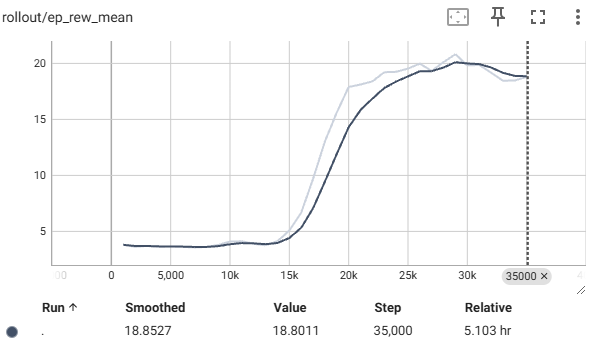
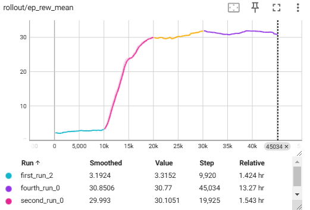
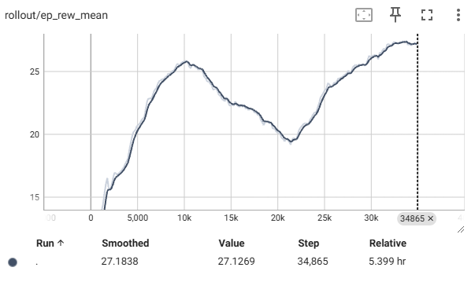

# Highway Environment - Reinforcement Learning Agent Comparison

This repository contains the implementation of various reinforcement learning algorithms for training agents in the `highway-v0` environment. The goal is to train high-performing agents capable of navigating a highway safely, efficiently, and effectively.

## Algorithms Compared

The following RL algorithms were implemented and evaluated:

1. **A2C (Advantage Actor-Critic)**  
2. **DDPG (Deep Deterministic Policy Gradient)**  
3. **SAC (Soft Actor-Critic)**  
4. **TD3 (Twin Delayed Deep Deterministic Policy Gradient)**  
5. **PPO (Proximal Policy Optimization)**  

---

## Environment Details

The training environment is based on `highway-v0` from the `highway-env` library. Agents are required to learn behaviors such as staying on the road, maintaining safe distances, and avoiding collisions while optimizing for rewards.

### Configuration:
- **Action Space**: Continuous
- **Simulation Frequency**: 15 steps per second

---

## Reward Function

The reward function encourages desirable behaviors such as:
- Staying on the road.
- Maintaining a target speed.
- Avoiding collisions.
- Penalizing undesirable behaviors like going off-road or jerky movements.

## Results and Comparisons

### Metrics Evaluated:
1. **Episode Length (`rollout/ep_len_mean`)**: Measures how long the agent survives in an episode.
2. **Reward (`rollout/ep_rew_mean`)**: Average reward earned by the agent per episode.

### Performance Summary:

| Algorithm | Avg. Episode Length | Avg. Reward | Observations                          |
|-----------|----------------------|-------------|---------------------------------------|
| **A2C**   | ~40                 | ~19         | Stable but rewards plateau early.     |
| **DDPG**  | ~39.6               | ~29         | High rewards but more fluctuations.   |
| **SAC**   | ~39.8               | ~23         | Good performance with some variance.  |
| **TD3**   | **~39.9**             | **~32**     | Best performance overall. Balanced exploration and exploitation effectively |
| **PPO**   | 40               | ~10         | Stable but lower rewards.    |

### Key Insights:
- **TD3** achieved the highest average reward (~31) and maintained near-max episode lengths (~39.9).
- **PPO** were stable but offered lower rewards compared to DDPG and TD3.
- **DDPG** displayed strong rewards but had higher fluctuations, requiring careful tuning.(reduce learning rate)

### Performance Plots

#### A2C Performance:

#### TD3 Performance:

#### DDPG Performance:

## Conclusion

After evaluating multiple RL algorithms in the `highway-v0` environment, **TD3** emerged as the best-performing model, showcasing:
- **Highest Rewards:** ~31 on average.
- **Longest Episode Lengths:** Consistently around ~39.9 steps.
- **Suitability for Continuous Action Spaces:** Reliable and efficient.

While other models like **DDPG** and **SAC** showed promise, **TD3**’s performance highlights its robustness and effectiveness in high-dimensional environments.

